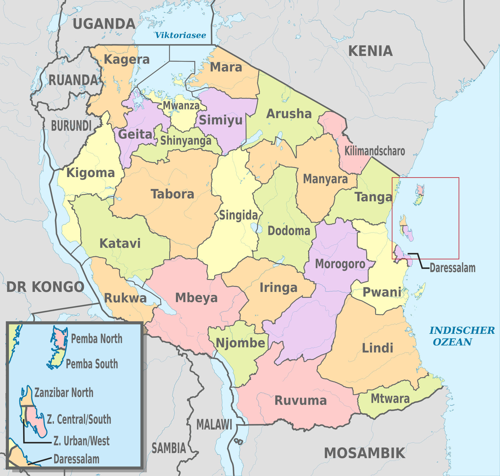

# Pump it Up: A Cool Title on Tanzania

Despite Tanzania's noteworthy renewable water resources (96.27 km^3 per year), in 2002 it was reported that only 42% of rural households could access "improved" water and water sources and that only 30% of all water system in the country were opperable. As such, the Government of Tanzaia began a massive sector reform of thier water system. Unfortunately, due to the decentralization of water management, the weight of improving access to clean water points often falls on local government.

With limited resources, it becomes critical to predict the funtionality of the wells serving different communities so that monies can be spent where they will have the greatest impact. As such, the "Pump It Up" challenge has participants predict wether a given well is "functional", "non-functional", or "functional - needs repair". The data competitors were provided with contained, where known, information on the location of the well (latitude/longitude, and multiple features listing which Region/District/Ward/Subvillage), the type, quality, installation date, and management of the well, as well as who funded and installed the well.

Tanzania is divided into 31 different *regions*, which themselves are then subdivided into *districts*. Districts are further subdivided into *divisions* and then into *wards*. Wards then have two types: *urban wards* which can be split into streets, and *rural wards* which can be split into villages. [2](2)

**Regions**
 As of 2016 there are 31 administrative regions in Tanzania. The Songwe Region is the most recently created region, having been created from the western portion of the Mbeya region, seen here in the left-hand corner of Tanzania. Songwe is not picture here, which is beneficial to the understanding of this analysis, as the data colleceted here covers 1960-2013, and therefore does not reflect the establishment of this region.
The next most recently created regions are the Geita, Katavi, Njombe, and Simiyu Regions, all originating in 2012.

[1]: https://en.wikipedia.org/wiki/Water_supply_and_sanitation_in_Tanzania#cite_note-8 "Water supply and sanitation in Tanzania - Wikipedia"
[2]: https://en.wikipedia.org/wiki/Regions_of_Tanzania "Regions of Tanzania - Wikipedia"
