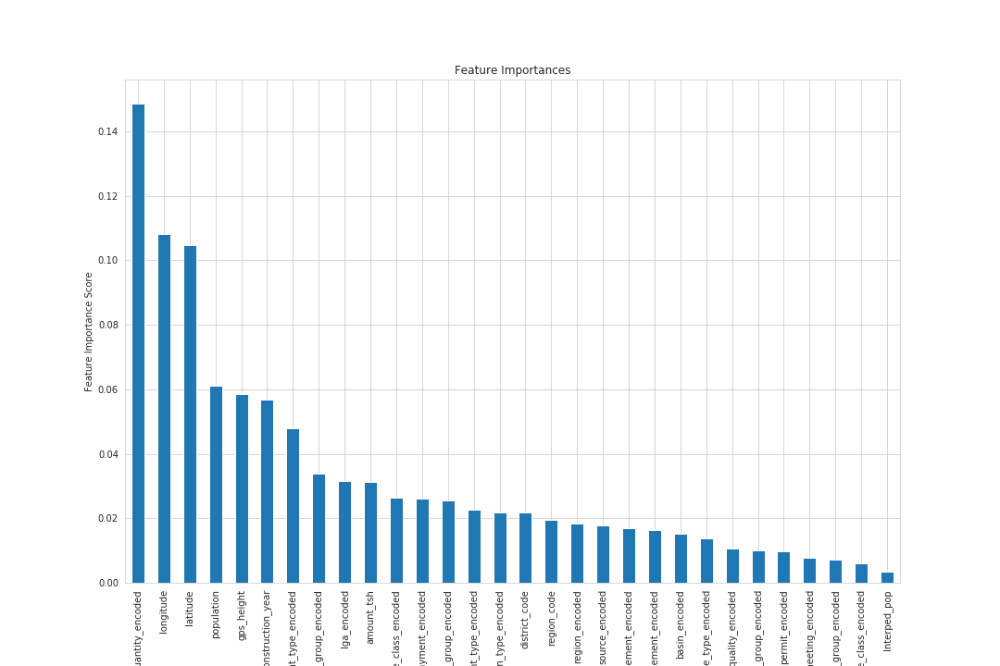
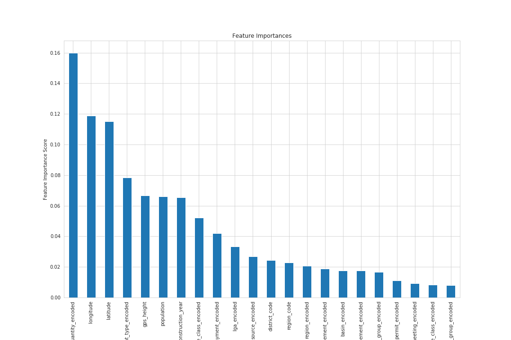
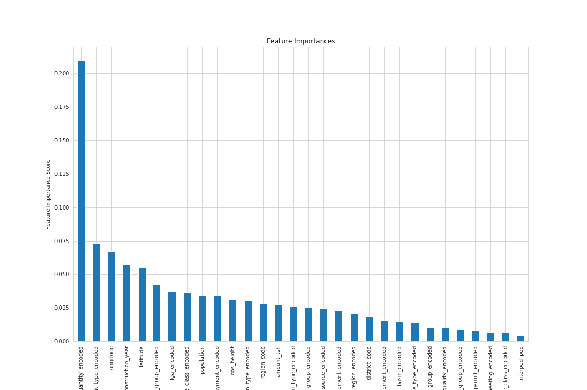
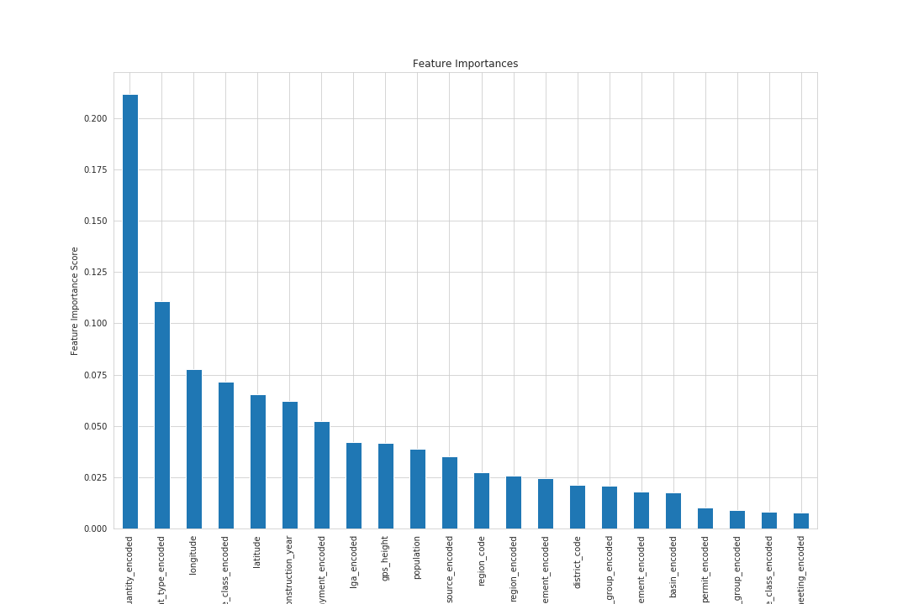
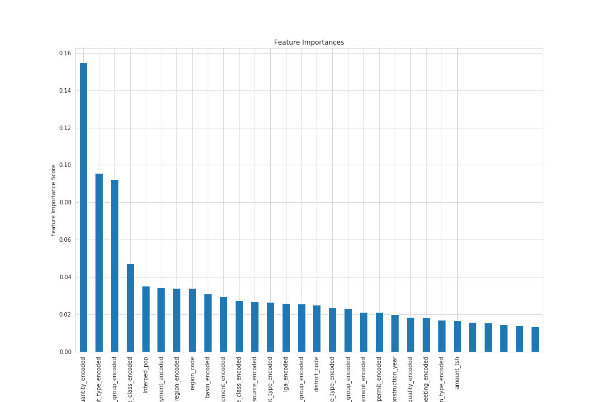
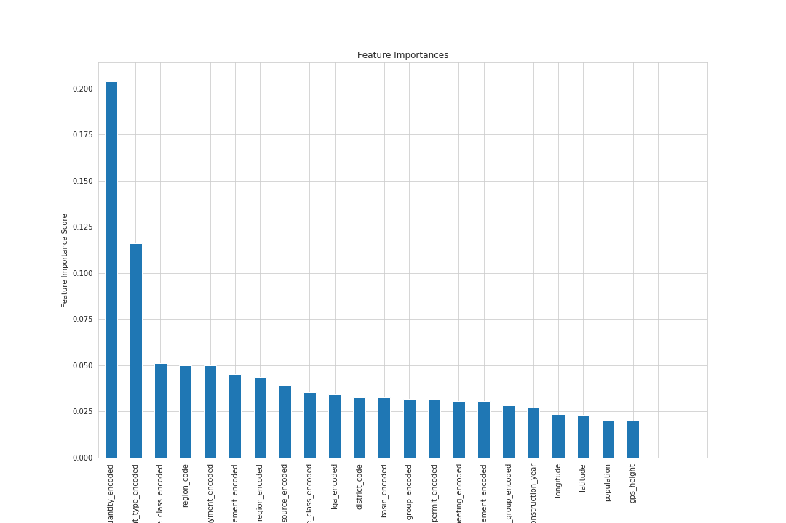

# Pump it Up: Predicting the Functionality of Tanzania's Waterpoints

Despite Tanzania's noteworthy renewable water resources (96.27 km^3 per year), in 2002 it was reported that only 42% of rural households could access "improved" water/water sources and that only 30% of all water systems in the country were operable. As such, the Government of Tanzania began a massive sector reform of their water systems.

With limited, decentralized resources, it becomes critical to predict the functionality of the various waterpoints before committing resources to their repair or maintenance. The "Pump It Up" challenge has one predict a well to be "functional", "functional - needs repair", or "non-functional".

## General Overview

In this project, I mined, cleaned, and processed the data provided for the Pump It Up challenge. The data contains information on the location of the well (latitude/longitude, and multiple features listing which Region/District/Ward/Subvillage), the type, quality, installation date, and management of the well, as well as who funded and installed the well. Unfortunately there exist large swaths of observations for which no quantitative data is found. As such, this challenge's most important aspect was value imputation. To this end, I sought to create imputations built on the most granular location information I could find.

After the inital cleaning stage, I modeled the data using three classification ensemble methods: *Random Forest*, *Gradient Boosting* and *Extreme Gradient Boosting*. For each of these three methods, models were trained on the full data set and on a more parsimonious feature set determined during the cleaning stage. These naive models were tuned using grid search crossvalidation and then refit with the optimized parameters. The tuned models were then used to create predictions on the provided testing data set. Finally, the generated predictions were submitted to the [challenge page](https://www.drivendata.org/competitions/7/pump-it-up-data-mining-the-water-table/page/23/) for scoring.

At the time of the most recent push to this repo, my best fitting model scored an accuracy of 81.86%, which placed me in 652nd place out of 8572 competitors. This places my model in the top 93% of all models submitted to the challenge. The top accuracy score for the challenge, at the time of the most recent push to this repo, was 82.86%, meaning that my score is exactly 1% off of the top position for the challenge.

### Understanding the Geographical Divisions of Tanzania

To understand the location feature levels in the data, it is helpful to have a general understanding of the geographical divisions of Tanzania itself.

Tanzania is divided into 31 different *regions*, which themselves are then subdivided into *districts*. Districts are further subdivided into *divisions* and then into *wards*. Wards then have two types: *urban wards* which can be split into streets, and *rural wards* which can be split into villages. [2](2) This information is captured in the challenge data under the labels `region`, `lga`, `ward`, and `subvillage`, with respect to increasing granularity. My analysis focuses on the first three of these, as I found that the `subvillage` feature had more than 19,000 unique levels.

**Regions**

 As of 2016, Tanzania has been divided into 31 different regions. As the water system management is highly decentralized, accurate location data is key to predicting the functionality of a well and to understanding the area around the well. To this end, I utilized publically available Tanzania census data from 2012, which is included here in this repo, to correctly adjust any mislabeled divisions of the regions, districts, and wards such that they were an accurate representation of the divisions of Tanzania at the time of the most recent data collection (2013).

### The Data

The data used in this analysis was taken from the Taarifa waterpoints dashboard, which provides an aggregation of data from the Tanzania Ministry of Water. It can be found on the [DrivenData competition page](https://www.drivendata.org/competitions/7/pump-it-up-data-mining-the-water-table/page/23/), although it can only be downloaded by competitors/DrivenData account holders. It's entirely free to sign up, if you'd like access to the data. An explanation of the various features, an example record, and a small explanation of the target feature can be found [here](https://www.drivendata.org/competitions/7/pump-it-up-data-mining-the-water-table/page/25/). I've also provided my own extensive notes on the data in the "Cleaning Analysis and Notes" notebook, which can be found here in the repo.

### Exploratory analysis

The full notes for the exploratory analysis conducted for this project can be found in the `Cleaning Analysis and Notes` file.

The majority of the data was found to be qualitative, and of these only a handful were found to have missing values. These are more fully discussed in the **Data Imputation** section. On the majority of cases, the missing values were given their own level and encoded along with the other levels of the categorical variables before modeling. In some cases where the class imbalance was notably high, and very few missing values existed, these values were filled with the most common level for the ward in which the observation was found.

Although there were far fewer numerical features, these were found to have notable amounts of missing observations. Zero was used as the missing flag in this data for the numerical features. As such, I decided to fill all numerical missing values using, in the majority case, mean imputation. These means were calculated over the most granular location information possible, as the majority of the numerical feature distributions were highly dependant on location.

### Data Imputation

#### Quantitative Features

The first natural step in imputing the numerical features was to correct and update the location information in the challenge data set, such that it reflected the divisions of Tanzania as they stood at the time of the 2012 census. To this end I created a dictionary of all regions, each region itself being a dictionary of all districts, and each district a dictionary containing information on the wards. I also stored in this dictionary information on the total population for each region, district, and ward, such that the population information in the challenge data set would be updated to reflect the numbers taken in the 2012 Tanzania census.

After updating the location information, I used the average population values, calculated from the above described dictionary, to estimate the average population across the district, and imputed this for all observations where the population had been marked as zero. The updated location information was also used when computing the mean to fill the `amount_tsh` and `construction_year` features.

When no information was available across an entire region, three separate methods were used to imput the three numerical features (`population`, `amount_tsh`, `construction_year`) filled using imputation.
1. Method for `population`: Divide the collected population value for the ward by the number of observations in the ward, to determine an average value. Imput this average.
2. Method for `amount_tsh`: Imput the data set mean, rather than a more granular mean.
3. Method for `construction_year`: Fit the data with a `loggamma` distribution. Generate imputation values randomly from this distribution, restricting the ceiling and floor of these estimates to the minimum and maximum of the training data.

#### Latitude and Longitude

Missing longitude values were marked with 0, while missing latitudes were marked with the value -2.000000e-08. These missing values were found to be linked (anywhere the longitude was missing, so was the latitude). Once the regions were updated, these missing values were filled using the average value for the region in which the observations were recorded.

#### Qualitative Features

The greatest number of missing values was in the `scheme_name` feature, with more than 28,000 missings. This feature was dropped from the modeling data, due to the incredibly high proportion of missings. Other categorical values with missings values were,

+ funder
+ installer
+ subvillage
+ public_meeting
+ scheme_management
+ permit

Of these, only `permit` and `public_meeting` were kept, and the missing values were simply encoded as unknowns.

Both `funder` and `installer` were found to have both notably high numbers of unique levels, as well as many, many inconsistencies in spelling and language. For example, it appears that a few wells were funded by the Swedish government. These different wells are listed as being funded by:
+ Sweden
+ Swedish
+ Sweeden
+ Swidish

Due to the high rates of irregularity in these features, they were dropped from the modeling data set. `scheme_management` was also dropped, as it was found to contain information highly similar to that captured by `management`, a feature with no missing values.

### Modeling

In order to model this data I selected three different ensemble methods: *random forest*, *gradient boosting*, and *extreme gradient boosting*. For each of these I created two models: one using the full feature set, not including any of those variables dropped due to their missing values of high number of levels, and one using a more parsimonious feature set, selected based on the full cleaning analysis. These models were then each tuned to discover their optimal parameters, and refit. The final tuned models were then used to generate predictions on the provided test set.

All models were tested using 5-fold crossvalidation, with either accuracy or multiple classification error rates (`# or errors/# of records`). Predictions submitted to the challenge page were scored using the classification rate (`# of correct predictions/# of records`).

#### Random Forest

The two random forest models yielded average accuracy scores of 81.17% and 81.14% for the full model and the parsimonious model, respectively, once fully tuned. These scores were calculated using 5-fold crossvalidation. Both models reported accuracy scores of over 90% when training on the full training set, indicating that there is some overfitting in both models.

  

  

Both models marked the quantity, latitude, longitude, and gps_height in the top 5 most important variables for classification. When submitting predictions from these two models, they were scored as being truly 81.80% and 81.55% accurate.

#### Gradient Boosting

The two gradient boosting models (GBM) returned average accuracy scores, after 5-fold crossvalidation, of 79.18% for the full model and 78.90% for the parsimonious model. These models experienced the least amount of overfitting, with accuracy scores near 80% when training on the full training set.

  

  

Both models selected quantity, waterpoint_type, longitude, and latitude as being in the top 5 most important features for predicting the target. Quantity, longitude, and latitude have been selected as being important by both the random forest models and the GBM models.

When these two models were submitted to the challenge site, they returned true accuracy scores of 79.70% and 79.47%, for the full and parsimonious models respectively.

#### Extreme Gradient Boosting

The two extreme gradient boosting models (XGB models) were given crossvalidation scores using multiple classification error (# of errors/# of records; merror) as the metric. The full and parsimonious models returned average merror rates of 19.56% and 19.45%, respectively.

  

  

Both models selected quantity and waterpoint_type as being among the top 5 most important variables for classification. When predictions were generated from these models, the full and parsimonious models received true accuracy scores of 81.86% and 81.62%, respectively.

#### Conclusion

The model which provided the most accurate predictions for the functionality of the wells was the full XGB model, with a classification rate of 81.86%. This score placed me in the top 93% of all competitors for the Pump It Up challenge.

Quantity was selected as being one of the most important features for prediction of the target in all three model groups, while waterpoint_type, latitude, and longitude were selected by at least two of the modeling groups. The full models outpreformed the parsimonious models across the board.

## Requirements

The requirements to run any portion of this project on your local machine are found in the `requirements.txt` file.

[1]: https://en.wikipedia.org/wiki/Water_supply_and_sanitation_in_Tanzania#cite_note-8 "Water supply and sanitation in Tanzania - Wikipedia"

[2]: https://en.wikipedia.org/wiki/Regions_of_Tanzania "Regions of Tanzania - Wikipedia"
